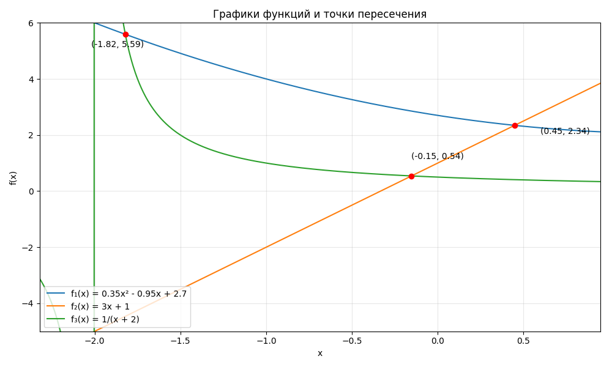
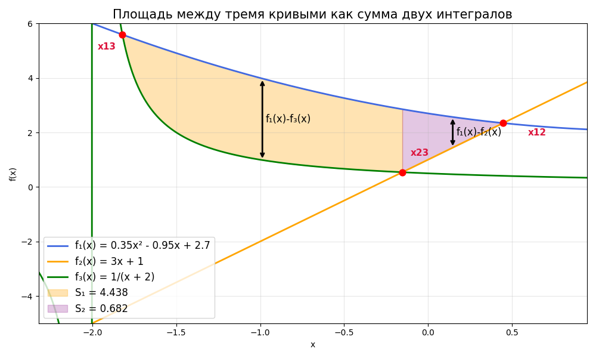

## Отчёт для задания № 6 по практикуму
#### Тема: «Сборка многомодульных программ. Вычисление корней уравнений и определенных интегралов».
#### Языки программирования: Си, ассемблер NASM.

---

> **Назначение программы** — вычислить площадь замкнутой фигуры, ограниченной тремя кривыми
> $f_1(x)=0{,}35x^2-0{,}95x+2{,}7$,
> $f_2(x)=3x+1$,
> $f_3(x)=\dfrac1{x+2}$.

Функциональные требования:

1. находить точки пересечения пар кривых (методом Ньютона);
2. разбивать фигуру на два простых под-домена;
3. брать определённые интегралы разности функций (адаптивная формула Симпсона);
4. складывать площади с требуемой точностью;
5. по опциям командной строки выводит вспомогательную статистику.

---

### 1. Состав проекта

| Файл                 | Содержимое                            | Краткое назначение                                                            |
| -------------------- | ------------------------------------- | ----------------------------------------------------------------------------- |
| **`CMakeLists.txt`** | правила сборки                        | выбирает формат объектных файлов NASM, на macOS принудительно собирает x86-64 |
| **`functions.asm`**  | `f1`, `f2`, `f3`, `df_poly2`, `df_f3` | реализация функций и некоторых производных на **x86-64 SSE2**                 |
| **`wrappers.c`**     | счётчики вызовов, таблицы указателей  | «прокладки» вокруг ассемблерных функций, инкрементируют глобальные счётчики   |
| **`newton.c / .h`**  | `root()`                              | поиск корня уравнения $f(x)=g(x)$ на $[a,b]$                                  |
| **`simpson.c / .h`** | `integral()`                          | определённый интеграл адаптивной формулой Симпсона                            |
| **`funcs.h`**        | extern-объявления                     | совместно для `main.c` и `wrappers.c`                                         |
| **`main.c`**         | точка входа, парсер опций             | вычисляет площадь + режимы тестирования                                       |

---

### 2. Сборка

```bash
mkdir build && cd build
cmake ..
cmake --build .
```

*На macOS* принудительно включается архитектура **x86-64** (не ARM).
В 64-битном режиме Position-Independent Code для ассемблера безопасен, поэтому отключение PIE оставлено как комментарий.

---

### 3. Математические основы и алгоритмы

#### 3.1 Метод Ньютона (`root()`)

```c
double x = (a + b) / 2;      // старт из середины
F  = f(x) - g(x);             // сама функция
Fp = df(x) - dg(x);           // её производная
x ← x - F/Fp                  // классический шаг Ньютона
```

* Особенности реализации

  * Лимит **1000** итераций — защита от зацикливания.
  * Если вышли за $[a,b]$ — «откат» к средней точке левой половины.
  * Остановка, когда `|F| < eps` **или** `|Δx| < eps`.
  * Обнаружение нулевой производной сигнализирует ошибку.

#### 3.2 Формула Симпсона (`integral()`)

1. Начинаем с двух отрезков ($n=2$), шаг $h=(b-a)/2$.
2. Дважды уменьшаем $h$, добавляя значения функции только в **новых** серединах — тем самым сохраняем прошлые вычисления без кеша.
3. Проверяем критерий сжатия

   $$
     |S_{\text{new}}-S| < 15\varepsilon;
   $$

   коэффициент **15** — классический для адаптивного Симпсона.

Эта итеративная версия не хранит массив значений, но каждый шаг пересчитывает сумму в точках с нечётными индексами инкрементно.

---

### 4. Ассемблерные функции (`functions.asm`)

Ключевые моменты реализации

* **64-битный SysV ABI**: аргумент `x` поступает в `xmm0`, результат возвращается в том же регистре.
* Используется только **SSE2** (инструкции `mulsd`, `addsd`, `divsd`).

#### `f1`

$$
f_1(x)=0{,}35x^2-0{,}95x+2{,}7
$$

1. `x` квадратируется → `x^2`.
2. Умножается на `a1=0.35`.
3. `x` копируется, умножается на `b1=-0.95`.
4. Складываются обе части + константа `c1=2.7`.

#### `f2`

$$
f_2(x)=3x+1
$$

Просто `x*3 + 1`.

#### `f3`

$$
f_3(x)=\dfrac1{x+2}
$$

1. `x ← x+2`.
2. `1 / xmm0`.

#### `df_poly2`

Обобщённая производная квадратичной

$$
\frac{d}{dx}(ax^2+bx+c)=2ax+b
$$

При вызове коэффициенты `a` и `b` передаются в `xmm1` и `xmm2`.

#### `df_f3`

$$
\left(\frac1{x+2}\right)'=-\dfrac1{(x+2)^2}
$$

---

### 5. Обвязка и учёт статистики (`wrappers.c`)

Каждая «обёртка» типа

```c
static double f1_w(double x) { ++f1_calls; return f1(x); }
```

* инкрементирует глобальный счётчик,
* вызывает «настоящую» функцию из `functions.asm`.

Массивы указателей дают удобный доступ по индексу:

```c
funcs  = {f1_w, f2_w, f3_w};
dfuncs = {df1_w, df2_w, df3_w};
```

Так `main.c` может перебирать функции по номеру без `switch`.

---

### 6. Поток выполнения `main.c`

1. **Парсинг опций**

   ```
   -roots  – вывести найденные точки пересечения
   -iters  – количество итераций Ньютона
   -calls  – счётчики вызовов функций
   -test-root f g a b eps
   -test-integral f a b eps
   ```
2. **Режим тестов** (`-test-*`) — отдельный ранний выход.
3. **Боевой режим**

   * ищем корни попарного равенства (`x13`, `x23`, `x12`);
   * строим две анонимные функции-разности:

     * $f_3-f_1$ на $[x_{13},x_{23}]$,
     * $f_2-f_1$ на $[x_{23},x_{12}]$;
   * интегрируем каждую, складываем площади;
   * выводим результат и, при необходимости, доп-статистику.


---
### 7. Графики функций





---

### 8. Примеры вызовов


| Команда                     | Что произойдёт                | Пример вывода                                                                                                                                                                                                                  |
| --------------------------- | ----------------------------- | ------------------------------------------------------------------------------------------------------------------------------------------------------------------------------------------------------------------------------ |
| **Базовый запуск**          | Вычислит только площадь       | `./area_calc`                                                                                                                                                                         |
| **Вывести корни**           | + точки пересечения           | `./area_calc -roots`                                                                                                         |
| **Полная статистика**       | + итерации + счётчики вызовов | `./area_calc -roots -iters -calls` |
| **Тест оценки корня**       | Найти $f_1=f_2$ на $[0,1]$    | `./area_calc -test-root 1 2 0 1 1e-6`                                                                                                                                        |
| **Тест интеграла**          | Интеграл $f_3$ на $[-1.5,1]$  | `./area_calc -test-integral 3 -1.5 1 1e-5`                                                                                                                                               |
| **Комбинация любых флагов** | Можно последовательно:        | `./area_calc -iters -roots`                                                                                                                                                             
---

### 9. Погрешности и параметры

| Константа  | Где        | Значение | Назначение                                 |
| ---------- | ---------- | -------- | ------------------------------------------ |
| `EPS`      | `main.c`   | `1e-3`   | точность площади (неявно через компоненты) |
| `EPS1`     | `main.c`   | `1e-5`   | целевая точность корней                    |
| `EPS2`     | `main.c`   | `1e-4`   | точность интеграла                         |


> **Критический путь:** для гарантии «итог ≤ EPS» выбран баланс
> `EPS1 < EPS2 < EPS`. Площадь зависит как от точности корней (границы интеграла), так и от точности интегрирования.

---

### 10. Технические детали

* **Системы:** Linux или macOS (x86-64).
* **Стандарт С:** `C99`, оптимизация `-O2`, предупреждения `-Wall`.
* **Число файлов:** 8 исходников C + 1 NASM.
* **Безопасность PIE:** ассемблер не использует абсолютных адресов, поэтому *Position-Independent Code* разрешён по умолчанию.
* **Скрипт `clean-all`** — удобная цель для IDE: пересобрать «с нуля».

## Заключение

Проект демонстрирует «учебный» симбиоз C и NASM:

* чистая логика и алгоритмы — на C;
* тяжёлые арифметические ядра — на SSE asm;
* сборка кросс-платформенная за счёт **CMake**.

Код хорошо иллюстрирует практику:

* передачи функций через указатели;
* оборачивания сторонних реализаций счётчиками;
* адаптивных численных методов с контролем погрешности.

При необходимости проект легко расширяется — достаточно добавить новые функции и их производные в `functions.asm` плюс обёртки.
